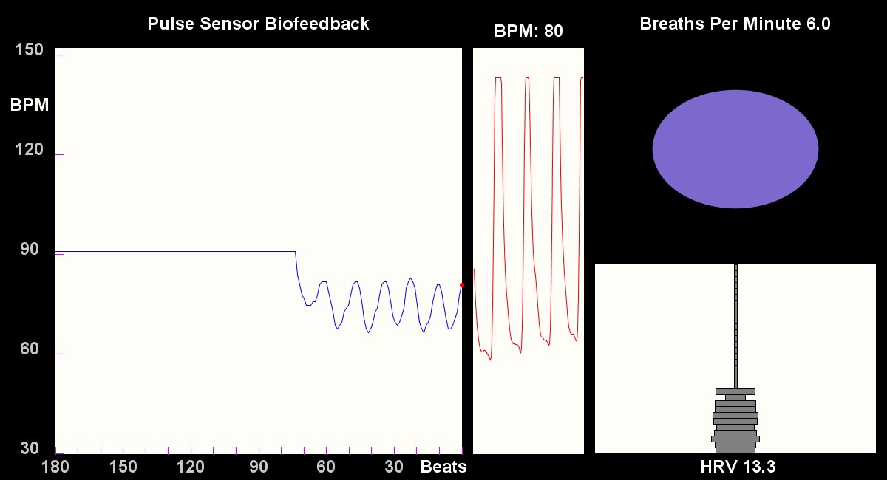

## <a href="https://processing.org"> Processing</a> HRV Biofeedback & <a href="http://www.pulsesensor.com">PulseSensor</a>

This Processing Sketch Heart Rate Variability Biofeedback.

These sketches work with Arduino running PulseSensor BPM code and plugged into PulseSensor hardware. Follow the tutorial [HERE](https://pulsesensor.com/pages/getting-advanced) to get your Arduino set up to read the Pulse Sensor signal and output data to these sketches.

A thorough description of HRV can be found here:

*	 [HRV Poncair Plot](http://pulsesensor.com/pages/hrv-poincare-plot)

*  [HRV Time Domain Plot](http://pulsesensor.com/pages/hrv-time-domain)

*  [HRV Frequency Plot](http://pulsesensor.com/pages/hrv-freqeuncy-domain)

This sketch has 3 graphs and a breathing prompt.

The graph on the left is of BPM over time. Each time your heart beats, it will graph the Instantaneous BPM.

The graph in the middle is a graph of the Pulse Sensor Signal.

Lower right is a bar graph of the HRV. In this case it is the difference in BPM between the most recent peak and trough of the BPM wave. The graph is updated at every peak and trough of the BPM wave.

Upper right is the breathing prompt. Inhale while the oval is growing, and exhale while the oval is shrinking. To change the breaths per minute, press the following keys on your keyboard.

| Key | Breaths Per Minute |
| :---: | :-------: |
| 1 | 4 |
| 2 | 4.5 |
| 3 | 5 |
| 4 | 5.5 |
| 5 | 6 |
| 6 | 6.5 |
| 7 | 7 |
| 8 | 7.5 |
| 9 | 8 |

